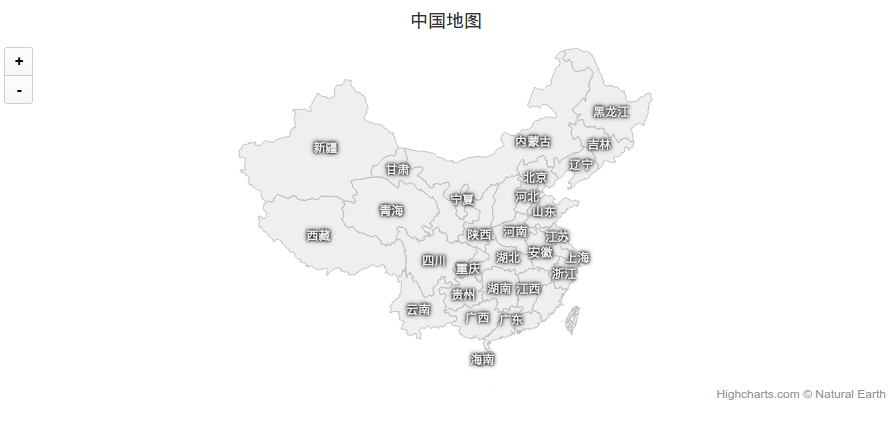

highcharts-chinese-map-zh
===
将 highcharts 中国地图的地名翻译成中文(注: 为使用方便将 bower_components 一起提交)

效果
---


例子
---
1. 请查看 `sample.html` 文件
2. [highcharts-chinese-map-zh 翻译例子](https://jsfiddle.net/cqmyg/herh4roy/2/)

使用方法
---

#####引入 `javascript` 文件

```html
<!-- 库文件(!!! 请替换为您自己的文件路径) -->
<script src="./bower_components/jquery/dist/jquery.min.js"></script>
<script src="./bower_components/highcharts/highmaps.js"></script>

<!-- 地图数据文件和翻译文件(!!! 请替换为您自己的文件路径) -->
<script src="./javascript/china-map.js"></script>
<script src="./javascript/china-map-translate.js"></script
```

#####绘制地图

```javascript

var mapTranslate = Highcharts.maps["translate/china"]; // 引入翻译文件

buildMapCharts("中国地图", $("#china_map")); // #china_map 是 html 文件中的 div 标签的 ID


function buildMapCharts(title, element) {

    element.highcharts('Map', {
        title: {
            text: title
        },

        credits: {
            enabled: true
        },

        mapNavigation: {
            enabled: true
        },

        legend: {
            enabled: false
        },

        series: [{
            mapData: Highcharts.maps["countries/cn/custom/cn-all-sar-taiwan"],
            name: title,
            nullColor: 'rgba(200, 200, 200, 0.3)',
            dataLabels: {
               enabled: true,
               color: '#eee',
               formatter: function () {
                   return mapTranslate[this.key]; // 返回中文名称
               },
               style: {
                   fontWeight: 'bold'
               }
           }
        }]
    });
}
```
